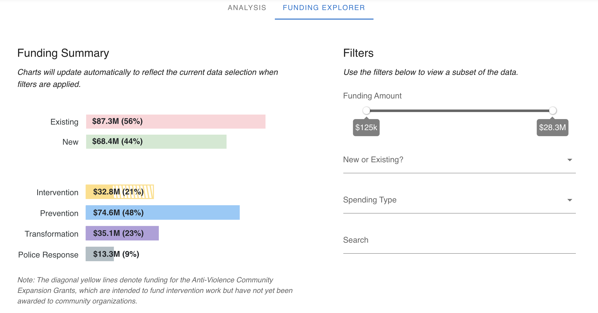
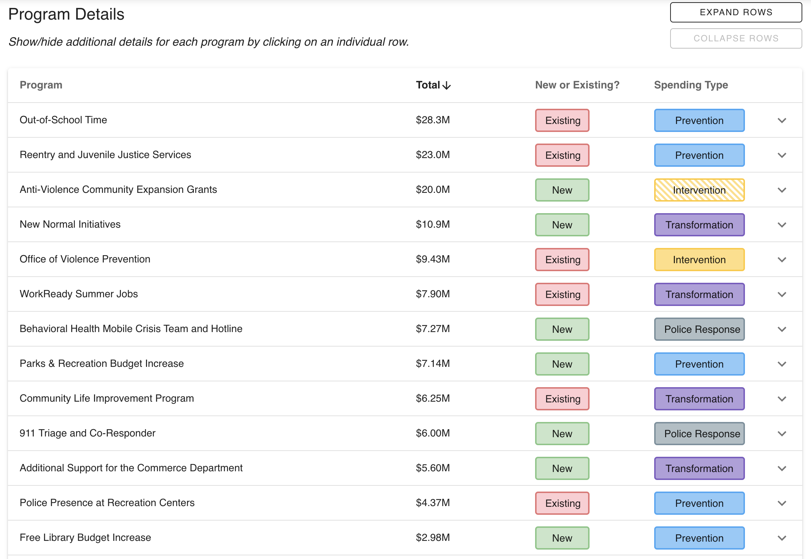

# The FY22 Anti-Violence Funding Explorer

As part of its ongoing commitment to transparency around how the City of Philadelphia spends taxpayer money, the Office of the City Controller released an analysis of the Kenney administration’s $155 million in budgeted anti-violence spending for fiscal year 2022 (FY22). The release includes an interactive funding explorer tool that allows individuals to filter programming by amount, new or existing funding, and spending type, as well as providing a detailed description of the programming.

This repository holds the software behind the interactive data release and funding explorer. The tool is available [here](https://controller.phila.gov/philadelphia-audits/fy22-anti-violence-budget/#/).





## Tools

The application is built using a combination of open-source tools, including:

- [vue](https://github.com/vuejs/vue);
- [vue-apexcharts](https://github.com/apexcharts/vue-apexcharts), and;
- [vuetify](https://github.com/vuetifyjs/vuetify).
## Development

### Project setup
```
yarn install
```

#### Compiles and hot-reloads for development
```
yarn serve
```

#### Compiles and minifies for production
```
yarn build
```
